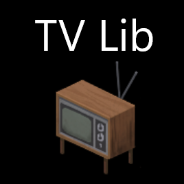

# TVLib



## Description
TVLib is a comprehensive mod that enhances your Project Zomboid experience by providing a rich collection of TV shows and radio broadcasts. Customize and expand your in-game media with ease using our functions to add or replace TV shows.

## Features
- Add new TV shows
- Replace existing TV shows
- Scheduled broadcasts

## Installation
1. Download the mod files from the GitHub repository.
2. Place the mod folder in the appropriate directory in your Project Zomboid installation.
3. Drop the vanilla RadioData.xml from {GameFiles}/media/radio in {ModLocation}/media/radio/vanilla 
4. Add the following lines to your `OnInitWorld` event in Project Zomboid to use the mod functions:

```lua
Events.OnInitWorld.Add(function()
    if TVLib and TVLib.addTVShows then
        TVLib.addTVShows({
            {
                id = "aece616a-4883-4e09-bd35-39aed89fe655",
                startTime = "100",
                day = 0,
                freq = 88000,
                advertCat = "none",
                isSegment = false,
                lines = {
                    { ID = "d3e99611-97b3-4ac2-bc8a-cf9641b470c8", r = 0, g = 176, b = 80, text = "Y'all are watching Woodcraft!" },
                    { ID = "b31bcd26-273a-42e4-be83-0f6dbc362e6a", r = 128, g = 128, b = 255, codes = "COO+1", text = "To start, you need some cooked chicken." },
                    { ID = "ba88efb8-6046-4b62-ba0b-a85346f7d459", r = 128, g = 128, b = 255, text = "The smell of home, y'know?" }
                }
            },
            {
                id = "another-id",
                startTime = "150",
                day = 0,
                freq = 88000,
                advertCat = "none",
                isSegment = false,
                lines = {
                    { ID = "example-id", r = 0, g = 176, b = 80, text = "Another show entry." }
                }
            }
        })
    else
        print("TVLib or TVLib.addTVShows not available.")
    end
end)

Events.OnInitWorld.Add(function()
    if TVLib and TVLib.replaceTVShows then
        TVLib.replaceTVShows({
            {
                id = "aece616a-4883-4e09-bd35-39aed89fe655",
                replaceid = "75d511c5-cb3f-41cc-81c9-b47df52957ae",
                isSegment = false,
                lines = {
                    { ID = "d3e99611-97b3-4ac2-bc8a-cf9641b470c8", r = 0, g = 176, b = 80, text = "Y'all are watching Woodcraft!" },
                    { ID = "b31bcd26-273a-42e4-be83-0f6dbc362e6a", r = 128, g = 128, b = 255, codes = "COO+1", text = "To start, you need some cooked chicken." },
                    { ID = "ba88efb8-6046-4b62-ba0b-a85346f7d459", r = 128, g = 128, b = 255, text = "The smell of home, y'know?" }
                }
            },
            {
                id = "another-id",
                replaceid = "another-replaceid",
                isSegment = false,
                lines = {
                    { ID = "example-id", r = 0, g = 176, b = 80, text = "Another show entry." }
                }
            }
        })
    else
        print("TVLib or TVLib.replaceTVShows not available.")
    end
end)
